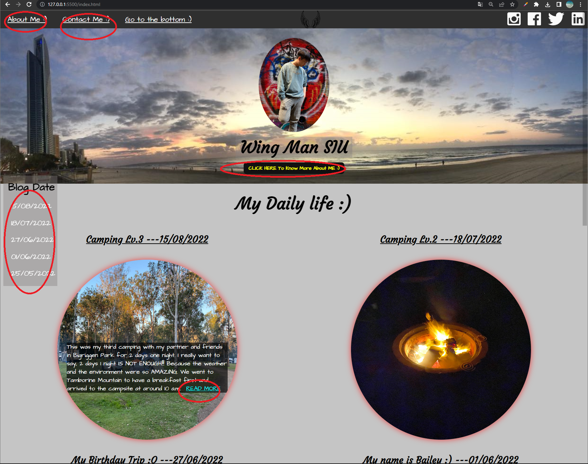
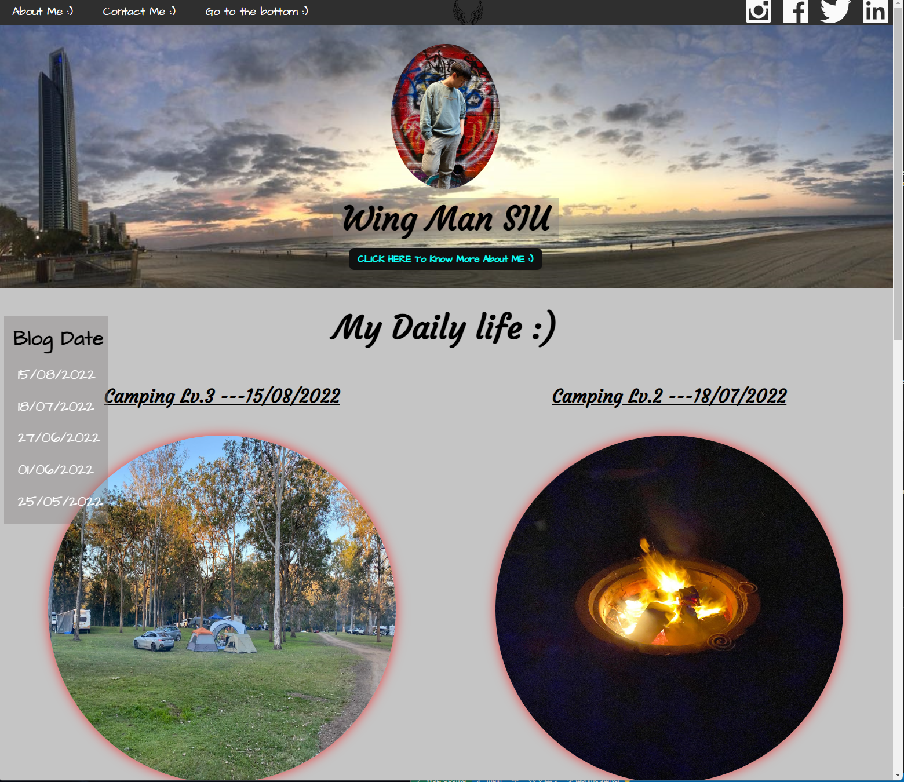
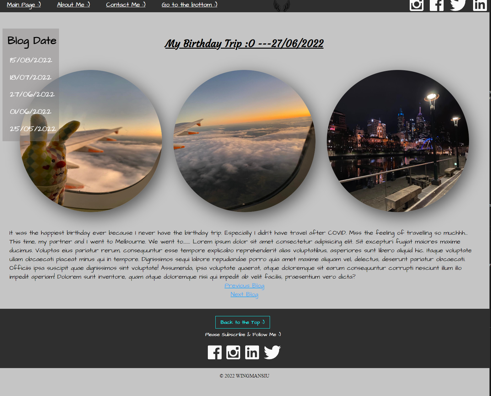
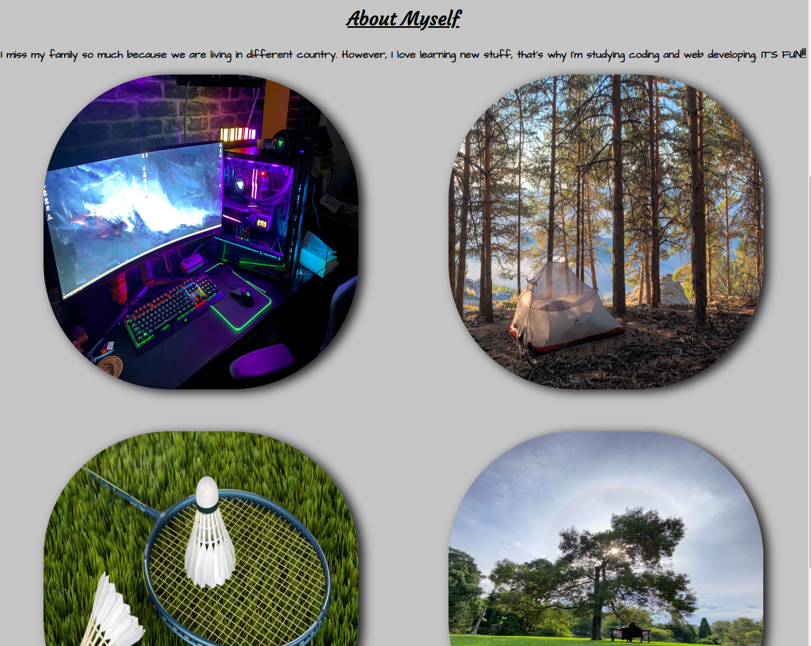
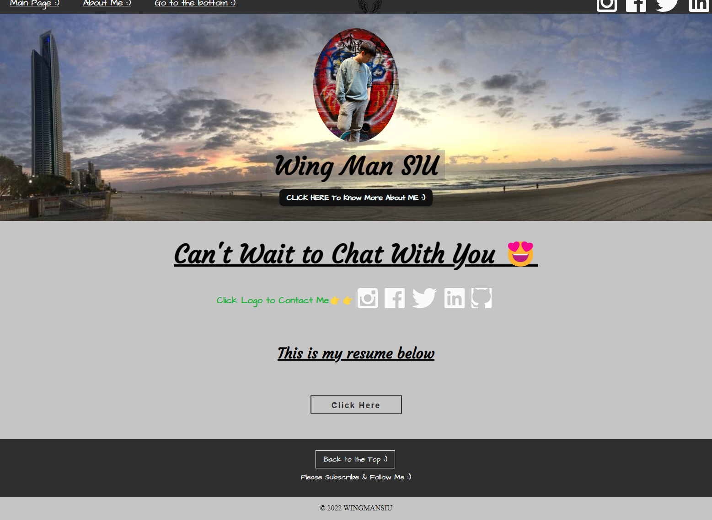

# T1A2 Portfolio - WING MAN SIU  13183

Portfolio >    http://127.0.0.1:5500/index.html
Github >    https://github.com/fishball0741/T1A2

Purpose

Functionality and features

Main Page

This page is a main page for viewers to see all of the features such as all of the blogs. If they want to know more about one of the blog then they can click to the blog's page or other pages as well.

About Me

This page is mainly showing my personality and hobbies to the viewers.

Contact Me

This page is for the viewers who can contact me from my social media links. Moreover, there are the resume providing for the viewer to see or download.

Blogs

There are 5 different blog pages for the viewers. Those are my happies memories that's the reason to share for.

Sitemap 

I designed all the pages can linked to each other because it is more convenient and friendly for the viewers to browse.

Screenshots

Target Audience

This portfolio was created for showing what I learnt from Coder Academy such as Html, CSS, Terminal using etc.
