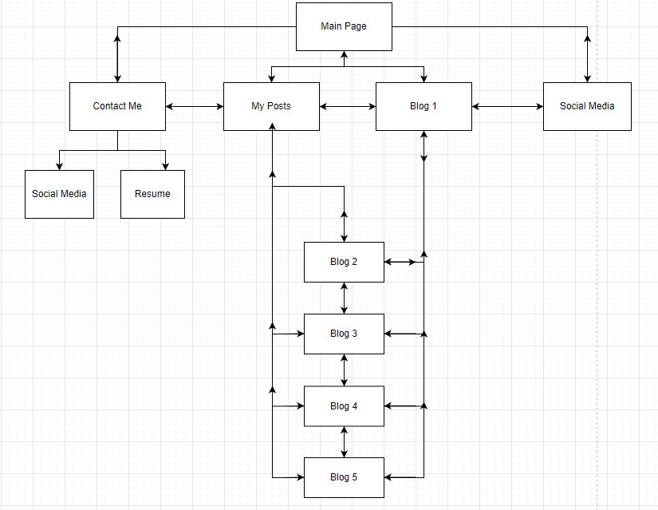
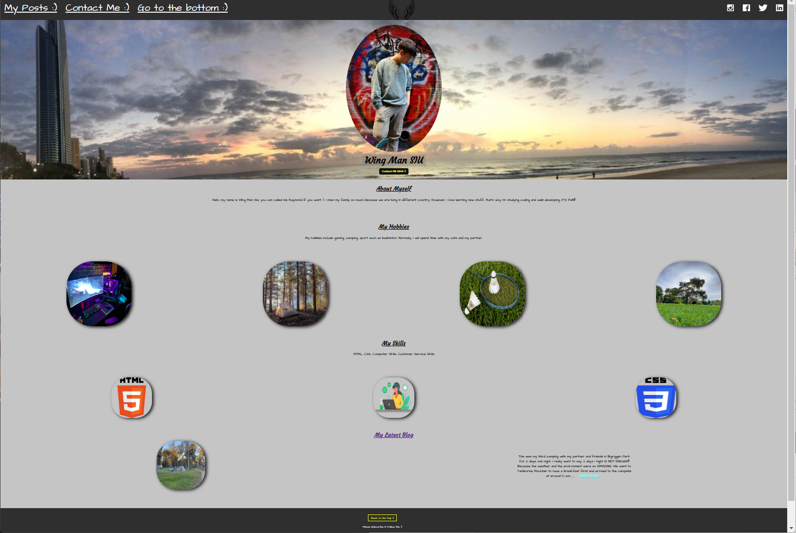
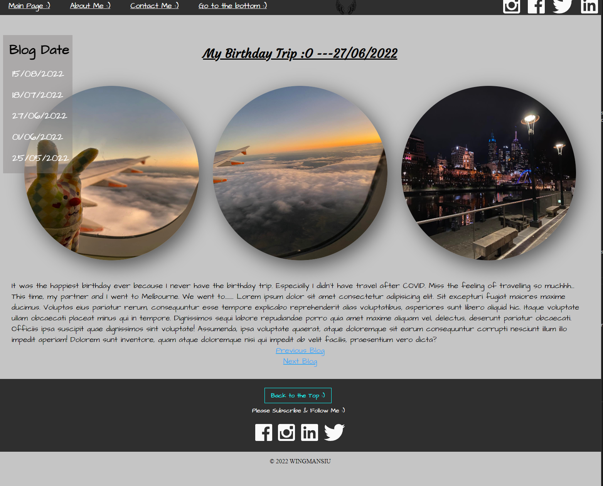
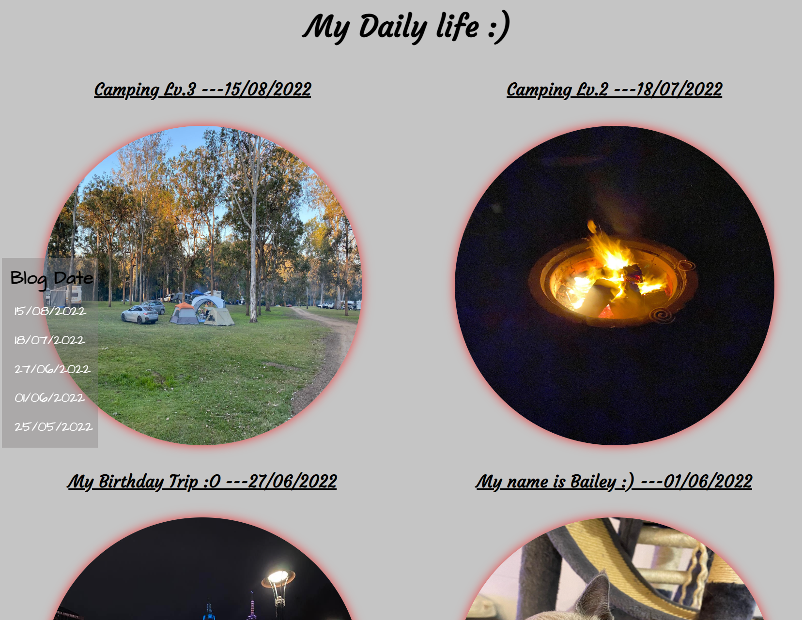
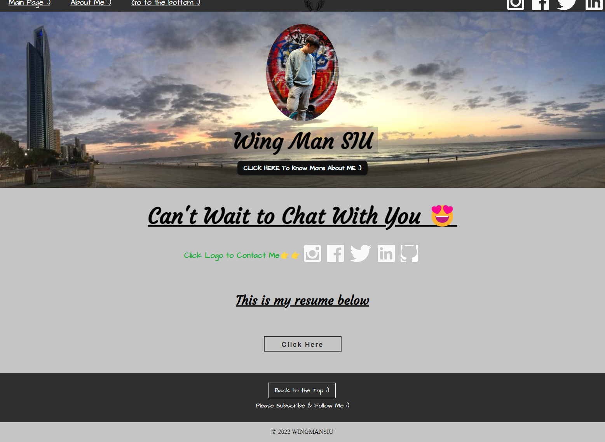
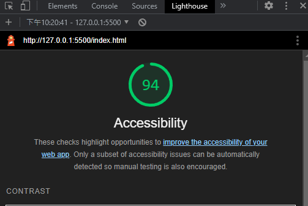

# T1A2 Portfolio - WING MAN SIU  13183

## Portfolio >

<https://fishball0741.github.io/T1A2/src>

## Github >

<https://github.com/fishball0741/T1A2>

### Presentation Link >

<https://www.youtube.com/watch?v=tNLJaV74eYY>

### Purpose

---
This portfolio was created for showing the skills that I learnt from the past few weeks such as HTML, CSS and different styling and features from the internet. Moreover, this website is mainly for those employers who are interested in my coding or design and willing to give an opportunity for me to work with :).

### Functionality and features

---
For this portfolio, there are lots of features that been added. For example, 1. Click the social media logo to link to my social media or professional accounts. 2. Colorful and eyes catching buttons are added for easier access to each pages. 3. Features added for the mobile device and improved the accessibility. 4. Favicon added. 5. Etc.

#### Main Page

---
This page is the main page and mainly showing my personality ,hobbies and skills to the viewers. Because this is the main page, the viewers can access to each pages and there are the latest blog detail on the bottom to let the viewers can easier to access the blog page. Moreover, there are the social media logos for the viewers to click and contact me.

#### My Posts

---
This page is a main blog page to link to other blog pages. The viewers can move the mouse to those images for knowing each blogs' details and good to click 'read more' to link to each blog pages.

#### Contact Me

---
This page is for the viewers who can contact me from my social media links. Moreover, there are the resume providing for the viewer to see or download. Mainly for showing the styling and features of my website.

#### Blogs

---
There are 5 different blog pages for the viewers. Those are my happies memories that's the reason to share for. Mainly for showing the styling and features of my blogs.

#### Sitemap

---

#### Screenshots

---

---

---

---

---

---

#### Target Audience

---
This portfolio was created for showing what I learnt from Coder Academy in the past few weeks such as Html, CSS, Terminal and Github using etc.. So my main target audiencewill be the people who are working as a dev or IT industry that can give me the opportunity to work with or share the experiences or tips of doing coding :).
